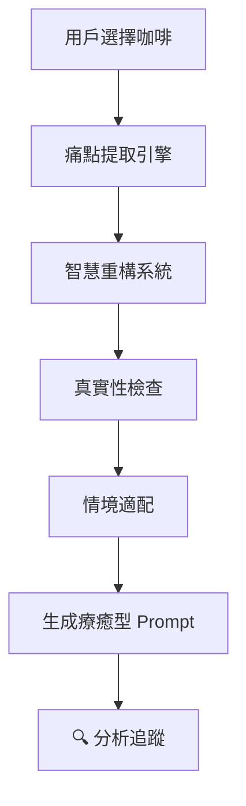

# 思考者咖啡 (Thinker Cafe) 產品架構規格書

**版本**: v2.0 (整合版)
**最後更新**: 2025-11-08
**核心 AI 引擎**: Gemini 2.5 Flash (Google) - **唯一 AI 模型**
**產品網址**: [thinker.cafe](https://thinker.cafe)
**創始人**: Cruz Tang

> **重要技術決策**: 本產品完全基於 Gemini 2.5 Flash 構建，這是**唯一使用的 AI 模型**。所有 AI 功能（療癒提示詞、記憶提取、課程推薦、內容生成）都使用 Gemini 2.5 Flash。Gemini 2.5 Flash 在 2025 年成為最強的免費 AI 引擎之一，具有超大 context window (2M tokens)、快速響應、和優秀的多語言能力。

> **架構整合決策**: Growth Platform (原 ThinkerKit) 已完全整合進 Website，成為一個統一的「療癒型個人成長平台 + 課程變現」系統。Website 從「形象網站」升級為完整的成長平台。  

---

## 🎯 產品願景

> **當科技回歸人性,智慧便有了溫度**

我們堅信,AI 不該是少數人的專利。透過創新與信任,我們致力於建立屬於這個時代的新平衡,讓每個人都能自由學習、持續成長。

---

## 📱 產品定位與核心理念

**思考者咖啡**是一個 AI 原生的**療癒型個人增強系統**,整合了:
- ☕ **療癒型智能提示詞** (Healing Prompt System) - **核心功能，產品靈魂**
- 📱 **自媒體內容引擎** (Content Engine) - **效率工具，輔助功能**
- 🔗 **個人品牌頁面** (Personal Page)
- 💾 **AI 記憶與分析系統** (Memory & Analysis System)

**核心價值主張**:  
「一杯咖啡的時間,讓 AI 成為你最誠實的思考夥伴」

### 核心理念：療癒優於效率

**思考者咖啡不是另一個「效率工具」**  
市面上已經有太多讓你「更快產出」的工具，但很少有工具幫你「更深思考」。

我們的核心信仰：
1. **誠實優於安慰** - 對抗有毒正能量 (Toxic Positivity)
2. **分析驅動** - 痛點提取 → 智慧重構 → 真實性檢查
3. **療癒賦權** - 不是逃避問題,而是直面並重構認知
4. **效率是結果，不是目的** - 當你內在清晰了，外在產出自然會快

### 產品哲學的兩層架構

```
思考者咖啡 = 療癒型系統（核心）+ 效率工具（表象）
                 ↓                      ↓
              心理健康              生產力提升
              深度思考              快速產出
              自我認識              內容創作
```

**為什麼這樣設計？**
- **療癒型提示詞**：是產品的靈魂，幫助用戶解決內在困擾
- **內容引擎**：是實用的外衣，吸引用戶進入產品，體驗深度思考的價值
- **策略意義**：先用「效率」吸引流量，再用「療癒」建立忠誠度

**使用場景示例**：
1. 用戶本來只想「生成一則 Threads 貼文」（效率需求）
2. 系統推薦「早安濃縮」提示詞，發現可以先釐清今天要傳達什麼（療癒引導）
3. 用戶在對話中覺察到自己的真實想法（療癒價值）
4. 最後產出的內容不只是「快」，而是「有靈魂」（複合價值）

---

## 🏗 系統架構總覽

### 整合後架構 (v2.0)

```
思考者咖啡 (Thinker Cafe) - 統一平台
│
├── 🌐 Website (thinker-cafe.com) - Next.js 15 + React 19
│   │
│   ├── (marketing) - 公開頁面
│   │   ├── 新首頁 (療癒型設計 + 咖啡時光展示)
│   │   ├── 課程列表 /products
│   │   ├── 課程詳情 /products/[id] (加入匹配度推薦)
│   │   └── 關於/聯絡
│   │
│   ├── (app) - 成長平台 (需登入) ⭐ Growth Platform 整合
│   │   ├── /dashboard - 個人儀表板
│   │   ├── /coffee/* - 咖啡時光 (morning/afternoon/evening)
│   │   ├── /memories/* - 記憶系統 + Memory Extractor
│   │   ├── /actions - 待辦清單 (Action Center)
│   │   ├── /recommendations - AI 推薦
│   │   └── /my/courses - 我的課程 + 進度追蹤
│   │
│   └── (auth) - 認證系統
│       └── Supabase Auth + LINE OAuth
│
├── 💾 資料層 - Supabase (統一資料庫)
│   ├── profiles - 用戶資料
│   ├── memories - 記憶系統 ⭐
│   ├── coffee_prompts - 咖啡時光記錄 ⭐
│   ├── recommendations - AI 推薦 ⭐
│   ├── actions - 待辦清單 ⭐
│   ├── user_growth - 成長數據 ⭐
│   ├── orders - 訂單系統
│   └── courses - 課程資料 (同步自 Notion)
│
├── 🤖 AI 層 - Gemini 2.5 Flash (唯一引擎)
│   ├── 療癒型提示詞生成
│   ├── 記憶提取與分析
│   ├── 課程匹配推薦 ⭐ 重要導流
│   ├── 痛點識別與重構
│   └── 自媒體內容生成
│
└── 🔗 外部整合
    ├── Notion API - 課程資料來源
    ├── LINE Bot - 推播通知
    ├── Vercel - 部署與 Cron Jobs
    └── Google Calendar (未來) - MCP 整合
```

### 核心技術棧

| 層級 | 技術 | 用途 |
|------|------|------|
| **前端** | Next.js 15 + React 19 | 統一應用框架 |
| **樣式** | Tailwind CSS 4 + shadcn/ui | UI 組件系統 |
| **資料庫** | Supabase Postgres | 統一資料存儲 |
| **認證** | Supabase Auth + LINE OAuth | 用戶登入 |
| **AI 引擎** | Gemini 2.5 Flash | **所有 AI 功能** |
| **部署** | Vercel | 託管與 CI/CD |
| **CMS** | Notion | 課程內容管理 |

---

## 🎨 四大核心功能

### 1. ☕ 療癒咖啡提示詞系統 (Healing Prompt System)

**概念**: 每一杯咖啡都是一組基於深度分析、賦權於你的 AI 提示詞

#### 1.1 產品形態
- **早安濃縮** (Morning Espresso) - 晨間規劃與目標設定 (注入能量、釐清目標)
- **午安瑪奇朵** (Afternoon Macchiato) - 中場提振與策略調整 (克服卡點、重新聚焦)
- **晚安低因** (Evening Decaf) - 睡前復盤與情緒重構 (療癒反思、安頓心靈)
- **客製化錦囊** (Custom Blend) - 根據紫微斗數的個人化建議

#### 1.2 技術實作 (融合 Thinker Kit 核心哲學)

**核心引擎**: 以「療癒型提示詞 (Healing Prompts)」為基礎，而非單純的指令庫

##### **五層分析架構**



**1. 痛點提取 (Pain Point Extraction)**
- **目的**: 不只是「記憶注入」,而是 AI 主動分析
- **方法**: 掃描用戶記憶中的:
  - 情緒關鍵詞 (焦慮、迷茫、壓力)
  - 重複出現的挫折模式
  - 未完成目標與內心矛盾
- **輸出**: 提取「真實困擾點」清單

**2. 智慧重構 (Intelligent Reframing)**
- **核心**: 運用心理學 Reframing 技巧,提供賦權、挑戰假設的新視角
- **好的 Reframing** (遵守原則):
  - ✅ 保持誠實 - 不美化現實
  - ✅ 賦權而非安慰 - 給予行動力而非空洞鼓勵
  - ✅ 挑戰假設而非否定感受 - "你確定這是唯一解法?"
- **壞的 Reframing** (嚴格避免):
  - ❌ 絕不使用空洞的「過度正向」
  - ❌ 絕不使用「有毒的正能量」(Toxic Positivity)
  - ❌ 絕不否定用戶的真實感受

**3. 真實性檢查 (Self-Deception Check)**
- **繼承自**: prompts-generator.js 的核心機制
- **方法**: 每個關鍵提示詞都內建「自我欺騙檢查」
- **範例**: 
  - Prompt: "你說你『沒時間』,但你確定不是『不想優先處理』?"
  - Prompt: "這個藉口你真心相信嗎?還是在幫自己找台階?"
- **目的**: 確保思考的誠實與深度

**4. 情境適配 (Context Adaptation)**
- 根據時間 (早/中/晚)、目標、情緒狀態
- 將上述分析結果包裝成對應的「咖啡」主題
- 語氣調整: 早晨 = 激勵、下午 = 務實、晚上 = 溫柔

**5. 品牌嵌入 (ASO Optimization)**
- 嵌入「思考者咖啡」品牌關鍵字
- 建立「查詢思考者咖啡 = 獲取最新 Prompt」的習慣

#### 1.3 使用流程 (融合分析追蹤)

1. **用戶選擇「咖啡類型」** (如: 早安濃縮)
2. **系統後台執行五層分析鏈**:
   ```
   (1) 當前活動掃描
   (2) 記憶深度分析
   (3) 痛點精準提取
   (4) 智慧重構生成
   (5) AI 自我反思
   ```
3. **生成客製化「療癒型 Prompt」**
4. **一鍵複製到 Gemini 2.5 Flash**
5. **🔍 提供「追蹤」按鈕** (繼承自 prompts-generation-flow.md):
   - 用戶可點擊查看:
     - 此 Prompt 基於哪些記憶
     - 提取了哪些痛點
     - 使用了什麼重構策略
   - **透明度 = 信任感**
6. **AI 回應後,可選擇「回存記憶」** - 完成思考閉環

#### 1.4 與現有 Thinker Kit 的整合

| 現有 Kit 功能 | 整合方式 |
|--------------|---------|
| `extractPainPoints` | 直接成為「痛點提取引擎」的核心函式 |
| Reframing 規則 | 寫入「智慧重構系統」的 Prompt |
| 自我欺騙檢查 | 成為「真實性檢查」層 |
| 分析追蹤介面 | 在每個咖啡頁面加入「🔍 追蹤」按鈕 |
| AI Admin 後台 | 擴展為整個平台的「Root Orchestrator」 |

---

### 2. 📱 自媒體內容引擎

**概念**: 根據用戶記憶,自動生成多平台內容

#### 2.1 支援平台與規格

| 平台 | 最佳字數 | 特色 | 生成策略 |
|------|---------|------|---------|
| **Threads** | 250 字 | 簡潔、對話式 | 一句金句 + 簡短說明 |
| **Instagram** | 150-200 字 | 視覺優先、hashtag | 3-5 hashtags + 簡短文案 |
| **Facebook** | 300-500 字 | 敘事性、深度 | 完整故事 + 行動呼籲 |
| **LinkedIn** | 400-600 字 | 專業、洞察 | 專業觀點 + 數據支撐 |
| **Twitter/X** | 280 字 | 精簡、話題性 | 爭議性問題 + 討論引導 |

#### 2.2 內容生成引擎

**A. 文案生成**
- 基於記憶提取關鍵主題
- 適配各平台風格
- 自動加入 CTA (Call-to-Action)

**B. 圖片生成**
- 使用 **ChatGPT DALL-E 3** 模型
- Prompt 優化: 視覺風格 + 品牌色調
- 自動適配社群平台尺寸

**C. 影片生成**
- 使用 **ChatGPT Sora 2** (2025 免費版)
- 短影片腳本自動生成
- 適合 Reels、TikTok、YouTube Shorts

#### 2.3 學習機制
```python
# 用戶回饋循環
用戶生成內容 → 微調 → 下次 Prompt 更新
│
├── 保存用戶偏好
├── 記錄成功案例
└── 優化生成策略
```

#### 2.4 使用流程
1. 選擇平台 (Threads/IG/FB/LinkedIn)
2. 系統根據記憶推薦 3 則貼文草稿
3. 用戶選擇 + 微調 (可選)
4. 一鍵複製 or 直接發布 (未來)
5. 微調內容會被學習,影響下次生成

---

### 3. 🔗 我的頁面 (Linktree 概念)

**概念**: 每位用戶都有專屬個人品牌頁面

#### 3.1 URL 結構
```
https://thinker.cafe/@用戶ID
```
例: `https://thinker.cafe/@cruztang`

#### 3.2 頁面功能

**A. 個人資料展示**
- 頭像、簡介、社群連結
- 作品集/成就展示
- 個性化佈景主題

**B. 預約系統整合**
- 整合思考者咖啡的預約模組
- 支援: 諮詢、教學、專案討論
- 自動日曆同步 (未來)

**C. 自訂區塊**
- 可拖曳排序
- 嵌入外部連結/影片
- 展示最新貼文

#### 3.3 價值主張
- **對用戶**: 免費擁有專業個人網站
- **對平台**: 每個用戶都是品牌大使
- **對 SEO**: 每個頁面都為主站引流

---

### 4. 💾 記憶系統

**概念**: AI 的「長期記憶」,作為分析引擎與內容原料的雙重核心

#### 4.1 記憶導入方式

**方式 A: JSON 格式 (推薦)**

**設計理念**：這不只是「資料儲存」，而是「療癒型分析」的基礎結構

```json
{
  "user_id": "cruztang",
  "profile": {
    "birth_date": "1985-03-15",
    "zodiac": "雙魚座",
    "life_goals": ["建立 AI 教育平台", "達到財務自由"],
    "work_style": "系統化思維、快速迭代",
    "cognitive_patterns": {
      "strengths": ["快速學習", "邏輯清晰"],
      "weaknesses": ["過度完美主義", "容易焦慮"]
    }
  },
  "memories": [
    {
      "id": "mem_001",
      "date": "2025-11-01",
      "category": "work",
      "content": "完成 ThinkerKit MVP 開發",
      "sentiment": "positive",
      "pain_points": [],
      "status": "resolved",
      "shareable_value": 8,
      "tags": ["成就", "技術"]
    },
    {
      "id": "mem_002",
      "date": "2025-11-05",
      "category": "emotion",
      "content": "對商業模式感到焦慮，不確定方向",
      "sentiment": "negative",
      "pain_points": [
        {
          "type": "cognitive_distortion",
          "name": "災難化思考",
          "description": "擔心如果不快速找到商業模式，公司就會失敗",
          "frequency": 3,
          "first_occurred": "2025-10-15"
        },
        {
          "type": "core_fear",
          "name": "財務不安全感",
          "description": "害怕收入不穩定",
          "intensity": 7,
          "related_beliefs": ["我必須賺很多錢才安全", "不賺錢就是失敗"]
        }
      ],
      "status": "active",
      "needs_healing": true,
      "suggested_reframe": "商業模式不明確不等於失敗，而是還在探索階段",
      "tags": ["焦慮", "商業", "self-doubt"]
    },
    {
      "id": "mem_003",
      "date": "2025-11-07",
      "category": "behavior",
      "content": "又拖延了運動計畫，連續三天沒去跑步",
      "sentiment": "neutral-regretful",
      "pain_points": [
        {
          "type": "behavior_pattern",
          "name": "拖延與自我欺騙",
          "description": "計畫了但不執行，並找藉口合理化",
          "frequency": 15,
          "excuses_used": ["今天太忙", "明天再說", "身體有點累"],
          "self_deception_level": "high"
        }
      ],
      "status": "active",
      "needs_healing": true,
      "suggested_challenge": "你真的想運動，還是覺得『應該』運動？",
      "tags": ["拖延", "健康", "習慣"]
    }
  ],
  "preferences": {
    "content_style": "直接、專業、有溫度",
    "favorite_platforms": ["Threads", "LinkedIn"],
    "prompt_tone": {
      "morning": "激勵且挑戰",
      "afternoon": "務實且直接",
      "evening": "溫柔但誠實"
    }
  },
  "analytics": {
    "total_memories": 45,
    "active_pain_points": 8,
    "resolved_issues": 12,
    "most_common_distortion": "災難化思考",
    "healing_progress_score": 6.5
  }
}
```

**關鍵設計特點**：

1. **Pain Points 結構化**
   - 不只是記錄「有困擾」，而是分析**困擾的類型**
   - 追蹤**頻率**、**強度**、**首次出現時間**
   - 記錄**自我欺騙程度**（Self-Deception Level）

2. **Cognitive Distortions 追蹤**
   - 記錄用戶常見的**認知扭曲**模式
   - 例如：災難化思考、二元思維、情緒化推理
   - 這是生成「真實性檢查」Prompt 的關鍵

3. **Suggested Reframe/Challenge**
   - 由 AI 預先分析並建議「重構方向」
   - 讓 Prompt 生成更精準

4. **Analytics 儀表板**
   - 追蹤用戶的「療癒進度」
   - 提供視覺化的成長軌跡

**方式 B: 純文字 (兼容)**
- 用戶直接貼上對話記錄
- AI 自動提取結構化資訊
- 較不精確,但降低使用門檻

#### 4.2 記憶應用場景 (雙核心架構)

**設計哲學**：記憶系統有兩個用途，但重要性不同

```
記憶系統 (100%)
├── 🔴 核心用途: 療癒分析引擎 (80% 重要性)
│   └── 為「咖啡提示詞」提供深度分析輸入
│
└── 🟢 次要用途: 內容引擎燃料 (20% 重要性)
    └── 為「自媒體內容」提供素材來源
```

##### **🔴 核心用途 A: 療癒分析引擎 (優先)**

**目的**: 作為「咖啡提示詞系統」的主要分析輸入

**關鍵原則**: 
- 記憶中的「負面情緒」、「未解決困擾」、「重複模式」是**最寶貴的資料**
- AI 不是要「安慰」用戶，而是要「挑戰」用戶的認知盲點
- 每一個痛點都是一次深度思考的入口

**工作流程**:
```python
# 每次生成咖啡提示詞時
def generate_healing_prompt(coffee_type, user_id):
    # 1. 掃描用戶記憶
    memories = load_user_memories(user_id)
    
    # 2. 提取「活躍的」困擾點（非「已解決」）
    active_pain_points = [
        m for m in memories 
        if m.status == "active" and m.sentiment in ["negative", "confused"]
    ]
    
    # 3. 分析情緒主題與重複模式
    emotion_themes = extract_recurring_themes(active_pain_points)
    cognitive_distortions = detect_thinking_errors(memories)
    
    # 4. 生成「誠實的」療癒型 Prompt
    prompt = create_healing_prompt(
        pain_points=active_pain_points,
        themes=emotion_themes,
        distortions=cognitive_distortions,
        coffee_style=coffee_type,
        reframing_rules=get_reframing_principles()
    )
    
    # 5. 加入「自我欺騙檢查」機制
    prompt = add_self_deception_check(prompt)
    
    return prompt
```

**具體應用範例**:

| 記憶內容 | AI 分析 | 生成的療癒 Prompt |
|---------|--------|------------------|
| "連續 3 天提到對收入焦慮" | 痛點：財務不安全感 | "你說你『沒錢』，但你上個月課程收入多少？客觀數字 vs 主觀感受，哪個才是真實？" |
| "寫了 TODO 但從不執行" | 模式：拖延與自我欺騙 | "這個 TODO 你寫了幾次了？你真的想做，還是覺得『應該』做？" |
| "抱怨沒時間運動" | 扭曲：時間稀缺假象 | "你昨天花了多少時間滑手機？是真的沒時間，還是沒有優先級？" |

**為什麼這是「核心」？**
- 這是思考者咖啡的靈魂功能
- 用戶會因為「被真實地理解」而忠誠
- 市面上沒有其他工具做這件事

---

##### **🟢 次要用途 B: 內容引擎燃料 (輔助)**

**目的**: 將記憶中「已解決」、「正向」片段，轉化為自媒體素材

**關鍵原則**:
- 只選擇**已經度過**的困難（不分享正在掙扎的事）
- 保持真實性（不美化過程）
- 提供價值（讓他人從你的經驗學習）

**篩選邏輯**:
```python
def select_shareable_memories(memories):
    # 只選擇「已解決」且「有價值」的記憶
    shareable = [
        m for m in memories
        if (
            m.status == "resolved" and 
            m.sentiment in ["positive", "neutral-reflective"] and
            m.shareable_value > 7  # 用戶主觀評分
        )
    ]
    return shareable
```

**具體應用範例**:

| 記憶內容 | 素材類型 | 轉化為內容 |
|---------|---------|-----------|
| "完成 ThinkerKit MVP 開發 (resolved, positive)" | 成功經驗 | **Threads 貼文**: "48 小時完成 MVP，AI Coding 的速度讓我重新定義『可能性』" |
| "克服了對 Public Speaking 的恐懼" | 個人成長 | **Instagram 圖文**: "從害怕上台到享受演講，我做了這 3 件事" |
| "建立了早起運動的習慣" | 習慣養成 | **LinkedIn 文章**: "為什麼我不再相信『意志力』？系統化習慣的力量" |

**為什麼這是「次要」？**
- 自媒體內容雖然實用，但不是產品的差異化優勢
- 市場上已經有很多內容生成工具
- 這個功能主要用來「吸引流量」，但不是「留住用戶」的核心

---

##### **兩者的協同效應**

```
療癒分析（內向） ──> 深度思考 ──> 真實洞察 ──> 有靈魂的內容（外向）
     ↑                                               ↓
     └──────────── 內容反饋 & 記憶更新 ────────────────┘
```

**理想的用戶旅程**:
1. 用戶想發一則 Threads 貼文（效率需求）
2. 系統建議先用「早安濃縮」釐清想法（療癒引導）
3. 在對話中，AI 挑戰用戶的認知盲點（療癒價值）
4. 用戶獲得真實洞察，產出有深度的內容（複合價值）
5. 發文後收到回饋，更新記憶（閉環）

---

##### **C. To-Do List 智能推薦**
```markdown
# 系統邏輯
IF 記憶中有「未完成目標」
THEN 生成提醒 Prompt
  → "上次你說要完成 X，進度如何？"
  → "這個目標你真心想做，還是覺得『應該』做？"（加入真實性檢查）
```

**B. 問卷式更新 (未來)**
- 系統定期推送簡短問題
- 範例: "這週的 X 專案完成了嗎?"
- 回答自動更新記憶

**C. 紫微斗數整合**
- 根據生辰八字自動計算
- 每日運勢 + 個性化建議
- 與 Prompt 系統深度整合

#### 4.3 Prompt 內建記憶更新機制
- 使用 Prompt 後,引導用戶回答進度
- 自動生成 JSON 格式記憶
- 無需手動填寫,在對話中完成

#### 4.4 隱私與安全
- 所有記憶加密存儲
- 用戶可隨時刪除
- 不與第三方分享 (除非用戶授權)

---

## 🎓 收益模組 (隱性整合)

### 課程推薦系統
- **觸發點**: 用戶使用特定功能時
- **範例**: 使用「影片生成」→ 推薦「AI 影片製作實戰課程」
- **形式**: 非侵入式橫幅廣告 or 提示

### 客製專案展示
- **位置**: 「我的頁面」底部
- **內容**: 成功案例 + 預約連結
- **策略**: 用實際作品吸引潛在客戶

---

## 🛠 技術架構

### AI 引擎架構 (v2.0 - Gemini 唯一)

**核心決策**: 完全採用 Gemini 2.5 Flash 作為**唯一** AI 引擎

> ⚠️ **重要**：本產品不使用 OpenAI API、Claude API 或其他 AI 模型。所有 AI 功能都使用 Gemini 2.5 Flash。

| 功能 | 使用引擎 | 實作位置 |
|------|---------|---------|
| **療癒型提示詞生成** | Gemini 2.5 Flash | `app/api/ai/coffee-prompt/route.ts` |
| **記憶提取與分析** | Gemini 2.5 Flash | `app/api/ai/extract-memory/route.ts` |
| **課程匹配推薦** | Gemini 2.5 Flash | `app/api/ai/match-course/route.ts` |
| **痛點識別** | Gemini 2.5 Flash | `lib/ai/prompts/memory.ts` |
| **認知扭曲分析** | Gemini 2.5 Flash | `lib/ai/prompts/cognitive.ts` |
| **自媒體內容生成** | Gemini 2.5 Flash | `app/api/ai/generate-content/route.ts` |
| **待辦推薦** | Gemini 2.5 Flash | `app/api/ai/recommend-action/route.ts` |

**為什麼選擇 Gemini 2.5 Flash？**
1. **Context Window 最大**: 2M tokens，足以處理完整的用戶記憶系統
2. **速度快**: 生成速度極快，適合即時互動
3. **完全免費**: 無需支付 API 費用（Free tier: 15 RPM）
4. **多語言優秀**: 對繁體中文的理解超越其他模型
5. **Google 生態整合**: 未來可整合 Gmail、Calendar、Drive
6. **原生 Function Calling**: 支援工具調用，適合 Agent 架構

**API 配置**:
```typescript
// lib/ai/gemini.ts
import { GoogleGenerativeAI } from '@google/generative-ai'

const genAI = new GoogleGenerativeAI(process.env.GEMINI_API_KEY!)

export const model = genAI.getGenerativeModel({
  model: 'gemini-2.5-flash'  // 唯一模型
})

// Rate Limiting
export const rateLimiter = {
  maxRequests: 15,  // Free tier limit
  perMinutes: 1
}
```

### 前端架構
```
Next.js 15.2.4 (App Router) - 統一框架
├── React 19 - UI 組件
├── Tailwind CSS 4.1.9 - 樣式系統
├── shadcn/ui - UI 組件庫
├── TypeScript 5.x - 型別安全
└── Vercel Analytics - 數據追蹤
```

### 後端架構
```
Supabase - 統一後端
├── PostgreSQL - 資料庫
│   ├── profiles (用戶)
│   ├── memories (記憶) ⭐ 新增
│   ├── coffee_prompts (咖啡時光) ⭐ 新增
│   ├── recommendations (推薦) ⭐ 新增
│   ├── actions (待辦) ⭐ 新增
│   ├── user_growth (成長數據) ⭐ 新增
│   ├── orders (訂單)
│   └── courses (課程)
│
├── Auth - 認證系統
│   ├── LINE OAuth (主要)
│   └── Email/Password (備用)
│
├── Storage - 檔案存儲
│   ├── 用戶頭像
│   └── 課程圖片
│
└── Realtime (未來) - 即時功能
    └── 推薦更新通知
```

### API Routes 架構
```
app/api/
├── ai/ - ⭐ Gemini AI 端點 (新增)
│   ├── coffee-prompt/ - 咖啡提示詞生成
│   ├── extract-memory/ - 記憶提取
│   ├── match-course/ - 課程匹配
│   └── generate-content/ - 內容生成
│
├── memories/ - ⭐ 記憶系統 (新增)
│   ├── GET/POST - CRUD operations
│   └── /timeline - 時間軸查詢
│
├── coffee/ - ⭐ 咖啡時光 (新增)
│   ├── /morning
│   ├── /afternoon
│   └── /evening
│
├── recommendations/ - ⭐ AI 推薦 (新增)
│   └── GET - 取得推薦列表
│
├── actions/ - ⭐ 待辦清單 (新增)
│   └── CRUD operations
│
├── cron/ - ⭐ 定時任務 (新增)
│   └── generate-daily-coffee/ - 預先生成咖啡內容
│
├── products/ - 課程 API (保留)
├── orders/ - 訂單 API (保留)
└── notion-data/ - Notion 同步 (保留)
```

### 進階整合 (可選項目)

**核心原則**：產品 100% 基於 Gemini 2.5 Flash，以下是可選的輔助工具

**1. MCP (Model Context Protocol) Servers**
- **狀態**: ✅ 計畫中
- **用途**: 連接外部工具和數據源
- **應用**: 
  - Google Calendar 整合（To-Do 提醒）
  - Gmail 整合（郵件內容記憶）
  - Notion 整合（知識庫連接）
- **重要**: MCP 是開放協議，不綁定特定 AI 服務

**2. n8n 工作流自動化**
- **狀態**: ✅ 已有經驗
- **用途**: 複雜的多步驟自動化
- **應用**:
  - 定時觸發記憶分析
  - 多平台內容同步發布
  - 數據備份與同步

**3. OpenAI AgentKit (未來考慮)**
- **狀態**: ⏸️ 觀望中
- **原因**: 依賴 OpenAI API，與當前技術棧不一致
- **替代方案**: 
  - Gemini 2.5 Flash 原生的 Function Calling
  - 自建輕量級 Agent 框架
  - n8n 工作流系統
- **可能性**: 如果未來需要 DALL-E 3 深度整合時可能考慮

---

## 📊 Monorepo 專案管理

### 整合後專案結構 (v2.0)

```
thinker-cafe/ (Monorepo Root)
│
├── projects/
│   ├── website/ - ⭐ 主平台 (Website + Growth Platform 整合)
│   │   ├── app/
│   │   │   ├── (marketing)/ - 公開頁面
│   │   │   ├── (app)/ - 成長平台 (Growth Platform 功能)
│   │   │   ├── (auth)/ - 認證
│   │   │   └── api/ - API Routes
│   │   ├── components/
│   │   │   ├── marketing/ - 行銷組件
│   │   │   ├── app/ - 成長平台組件 (從 Growth Platform 遷移)
│   │   │   └── shared/ - 共用組件
│   │   ├── lib/
│   │   │   ├── supabase/ - 資料庫 client
│   │   │   ├── ai/ - Gemini AI utils
│   │   │   ├── notion/ - Notion API
│   │   │   └── line/ - LINE 整合
│   │   ├── content/ - Prompts & Templates
│   │   ├── migrations/ - Supabase Migrations
│   │   └── types/ - TypeScript 型別
│   │
│   ├── news/ - AI 新聞系統
│   ├── paomateng/ - 台鐵監控
│   └── resume/ - Cruz 履歷
│
├── knowledge-base/ - 共用知識庫
│   ├── CLAUDE_ROOT.md - Monorepo 憲法
│   ├── 思考者咖啡產品架構規格書.md - 本檔案 ⭐
│   └── reports/ - 分析報告
│
├── .kiro/ - AI 人格系統
│   ├── personas/
│   │   ├── curator/ - 課程內容管理
│   │   ├── news-ai/ - 新聞生成
│   │   └── growth-ai/ - 成長平台 AI (新增)
│   └── scripts/ - 自動化腳本
│
└── CLAUDE.md - 當前工作索引
```

### Growth Platform 整合狀態

| 來源 | 目標 | 狀態 | 備註 |
|------|------|------|------|
| `projects/growth-platform/` | `projects/website/` | ✅ 規劃完成 | 完全合併 |
| Vite/React 組件 | Next.js App Router | ⏳ 待遷移 | 逐步改寫 |
| Neon Postgres | Supabase | ⏳ 待遷移 | Schema 已規劃 |
| LINE LIFF | Supabase Auth + LINE OAuth | ⏳ 待整合 | 認證統一 |
| Gemini 2.0 Flash | Gemini 2.5 Flash | ✅ 直接升級 | 模型一致 |

---

## 🚀 完整整合計畫 (v2.0)

### 整合目標

**從**：Website (形象網站) + Growth Platform (獨立 App)
**到**：思考者咖啡統一平台 (療癒型成長平台 + 課程變現)

### Phase 1: MVP (2週) - 最小可行版本

**目標**：證明整合可行性，最快上線測試

#### Week 1: 基礎建設
- [ ] **Day 1-2**: Supabase 建立新 tables
  - migrations/001_growth_tables.sql
  - memories, coffee_prompts, recommendations, actions, user_growth
  - RLS policies 設定
  - Triggers 建立

- [ ] **Day 3-4**: 認證系統整合
  - Supabase Auth 配置
  - LINE OAuth Provider 設定
  - 登入/註冊頁面 (`app/(auth)/`)
  - Session 管理

- [ ] **Day 5**: 首頁改版設計
  - Hero Section (療癒型設計)
  - Daily Coffee Section (靜態範例)
  - Features Section
  - 保留課程列表

#### Week 2: 核心功能
- [ ] **Day 6-7**: Dashboard 基礎版
  - `app/(app)/dashboard/page.tsx`
  - WelcomeSection
  - QuickActions
  - GrowthStats (簡單版)

- [ ] **Day 8-9**: 早安咖啡功能
  - `app/(app)/coffee/morning/page.tsx`
  - `app/api/ai/coffee-prompt/route.ts`
  - Gemini 2.5 Flash 整合
  - 未登入：顯示範例
  - 已登入：個人化生成

- [ ] **Day 10**: 部署與測試
  - Vercel 部署
  - 環境變數設定
  - 功能測試
  - Bug 修復

**MVP 成功指標**:
- [ ] 用戶可註冊登入
- [ ] 用戶可看到個人化咖啡時光
- [ ] 用戶可瀏覽課程並報名
- [ ] 系統穩定無重大 bug

---

### Phase 2: V1.0 (1個月) - 完整功能

#### Week 1-2: 記憶系統
- [ ] Memory Extractor 基礎版
  - `app/(app)/memories/extractor/page.tsx`
  - 對話式輸入框
  - Gemini 2.5 Flash 提取記憶
  - 儲存到 memories table

- [ ] Memory Timeline
  - `app/(app)/memories/page.tsx`
  - 顯示所有記憶
  - 基本篩選功能 (category, sentiment)
  - 痛點標籤視覺化

- [ ] 三個咖啡時光完整版
  - Morning, Afternoon, Evening
  - 時間自動切換
  - 基於記憶生成個人化內容
  - 五層分析架構實作

#### Week 3: 行動與推薦
- [ ] Actions (待辦清單)
  - `app/(app)/actions/page.tsx`
  - 從 Growth Platform 遷移
  - 與記憶系統整合
  - 智能推薦待辦事項

- [ ] AI Recommendations
  - `app/(app)/recommendations/page.tsx`
  - 基於記憶生成建議
  - 四層推薦架構
  - 不含命理學 (先跳過)

#### Week 4: 課程整合
- [ ] 課程推薦引擎 ⭐ 重要導流
  - `app/api/ai/match-course/route.ts`
  - 基於記憶匹配課程
  - Dashboard 顯示推薦
  - 課程頁面顯示匹配度

- [ ] 課程進度追蹤
  - `app/(app)/my/courses/page.tsx`
  - 學習記憶關聯
  - 進度視覺化
  - 下一步建議

- [ ] 完整測試與優化
  - E2E 測試
  - 效能優化
  - UI/UX 調整

**V1.0 成功指標**:
- [ ] 用戶每週使用 3+ 次咖啡時光
- [ ] 用戶平均 5+ 條記憶
- [ ] 課程推薦點擊率 > 20%
- [ ] 至少 1 位用戶透過推薦報名課程

---

### Phase 3: V2.0 (3個月) - 優化與擴展

#### 月份 1: 數據驅動優化
- [ ] **Analytics Dashboard** (內部)
  - 用戶行為追蹤
  - 轉換漏斗分析
  - A/B Testing 框架
  - Growth metrics 視覺化

- [ ] **UI/UX 優化**
  - 基於使用資料改進介面
  - 動畫與互動優化
  - 行動版體驗強化
  - 無障礙功能 (a11y)

#### 月份 2: 進階功能
- [ ] **命理學整合**
  - 占星分析
  - 數字學
  - 紫微斗數
  - 整合到推薦系統

- [ ] **自媒體內容引擎**
  - Blog 文章生成
  - 社群媒體內容
  - Newsletter 系統
  - 排程發布

- [ ] **個人品牌頁面**
  - 公開的成長展示頁 (`/@username`)
  - 成就系統
  - 分享功能
  - 自訂佈景主題

#### 月份 3: 生態系統
- [ ] **多語言支援**
  - 英文版本
  - 日文版本 (東南亞市場)
  - i18n 框架
  - 自動翻譯整合

- [ ] **LINE Bot 深度整合**
  - 主動推播咖啡時光
  - 對話式 Memory Extractor
  - Bot 內完成所有操作
  - Rich Menu 設計

- [ ] **社群功能**
  - 成長夥伴配對
  - 成長小組
  - 公開挑戰活動
  - 排行榜與徽章

**V2.0 成功指標**:
- [ ] DAU > 100 人
- [ ] 課程轉換率 > 10%
- [ ] 推薦準確度 > 30% 點擊率
- [ ] 用戶生成 100+ 自媒體內容

---

## 🚀 MVP 開發計畫

### Phase 1: 核心功能 (2 週)
- [ ] 記憶系統 (純文字 + JSON)
- [ ] 咖啡提示詞庫 (早中晚各 10 個)
- [ ] 內容生成引擎 (Threads + IG)
- [ ] 個人頁面基礎框架

### Phase 2: 整合與優化 (2 週)
- [ ] MCP Servers 整合（Google Calendar、Notion）
- [ ] 紫微斗數計算模組
- [ ] 學習機制（用戶回饋循環）
- [ ] 課程推薦系統
- [ ] Gemini Function Calling 深度應用

### Phase 3: 擴展與測試 (2 週)
- [ ] Facebook + LinkedIn 內容生成
- [ ] 影片生成功能 (Sora 2)
- [ ] 預約系統整合
- [ ] 30 位種子用戶測試

---

## 📈 成長策略

### 種子用戶計畫
- **目標**: 30 位早鳥用戶
- **來源**: Threads 粉絲、課程學員、LINE 群組
- **優惠**: 終身免費使用 (先建立用戶習慣)

### 病毒式成長機制
```
推薦獎勵制度:
├── 推薦 1 人 → 解鎖進階 Prompt 模板
├── 推薦 5 人 → 專屬「咖啡」命名權
└── 推薦 10 人 → 終身 VIP + 客製化服務
```

### ASO (AI Search Optimization)
- 在 Prompt 中嵌入品牌關鍵字
- 建立「思考者咖啡」查詢回應機制
- 讓 AI 逐步學習品牌關聯性

---

## 🎯 關鍵指標 (KPI)

### 產品指標
- **DAU/MAU**: 日活/月活用戶數
- **Prompt 使用率**: 每日 Prompt 複製次數
- **內容生成量**: 每日產出的貼文/圖片/影片數
- **記憶活躍度**: 用戶更新記憶的頻率

### 商業指標
- **課程轉換率**: 從推薦到購買的比例
- **客製專案詢問**: 透過「我的頁面」的預約數
- **病毒係數**: 平均每位用戶帶來的新用戶數

---

## 📱 APP 開發考量

### 現階段策略
- **優先**: Web App (PWA 漸進式應用)
- **原因**: 
  1. 開發速度快,可快速迭代
  2. 跨平台無需多版本維護
  3. 降低用戶下載門檻

### 未來 Native APP
- **時機**: 當 DAU > 1000 時
- **外包考量**: 
  - iOS: Swift/SwiftUI
  - Android: Kotlin/Jetpack Compose
- **必要性評估**: 
  - 推播通知需求
  - 離線功能需求
  - App Store 曝光機會

---

## 🔮 未來展望

### 短期 (3 個月內)
- [ ] Web App PWA 優化
- [ ] 多國語言支援 (英文、日文優先)
- [ ] 用戶數達到 300 人

### 中期 (6-12 個月)
- [ ] iOS + Android APP 開發
- [ ] AI Agent 自動發文功能
- [ ] 企業版 (團隊協作功能)

### 長期 (1-2 年)
- [ ] 成為華人 AI 工具的首選平台
- [ ] 建立 AI Prompt 交易市場
- [ ] 拓展到全球英語市場

---

## 🔄 用戶流程與導流機制

### 新用戶完整旅程

```
訪問首頁 (thinker-cafe.com)
    ↓
看到新設計 (療癒型 + 咖啡時光展示)
    ↓
體驗免費咖啡時光 (無需登入，顯示範例)
    ↓
「想要個人化內容嗎？」CTA
    ↓
註冊 (LINE Login 或 Email)
    ↓
Onboarding: 簡單問卷 (3-5 題)
  - 你的主要困擾是？
  - 你希望成長的領域？
  - 你的工作性質？
    ↓
Dashboard + 第一個個人化咖啡時光
    ↓
「試試 Memory Extractor 吧！」引導
    ↓
輸入第一條記憶
    ↓
AI 分析 (Gemini 2.5 Flash) + 推薦第一個行動
    ↓
(使用 3-7 天後)
    ↓
基於記憶推薦課程 ⭐ 關鍵導流點
    ↓
「這個課程 87% 匹配你的需求」
    ↓
報名課程 → 完成轉換
```

### 課程學員流程

```
報名課程
    ↓
自動開通課程權限 (Supabase)
    ↓
發送歡迎 Email + LINE 通知
    ↓
Dashboard 顯示「我的課程」
    ↓
課程進度追蹤組件
    ↓
課後自動提示:
「記錄今天的學習心得吧！」
    ↓
Memory Extractor 捕捉學習記憶
    ↓
AI 分析學習進度
    ↓
推薦下一步:
  - 相關行動項目
  - 進階課程
  - 實作專案
    ↓
課程結束後:
「根據你的學習記憶，推薦下一個課程...」
```

### 四大導流機制

#### 1. 咖啡時光 → 課程
```
早安咖啡提示:
「今天練習寫一個完整的 AI 提示詞吧！」
    ↓
用戶嘗試寫，發現不太會
    ↓
系統偵測:「看起來你對提示詞工程有興趣？」
    ↓
推薦課程 + 首次報名優惠
```

#### 2. 記憶 → 課程
```
Memory Extractor 分析:
「你已經提到 5 次想要學 AI 了」
    ↓
Dashboard 顯示:
「🎯 你的成長目標: 學習 AI」
「推薦課程: AI 提示詞工程 (匹配度 92%)」
    ↓
點擊 → 課程頁面 (特殊 tracking)
```

#### 3. 行動 → 課程
```
待辦清單中重複出現:
「學習 React」「練習 Next.js」
    ↓
AI 推薦:
「你最近在自學前端，需要系統化學習嗎？」
    ↓
推薦課程: Next.js 全端開發
```

#### 4. 課程頁面 → 咖啡時光
```
訪客瀏覽課程頁面
    ↓
底部 CTA:
「還不確定要報名？」
「先免費體驗我們的每日成長工具吧！」
    ↓
[體驗咖啡時光] → 註冊 → 培養習慣 → 回來報名
```

---

## 📝 版本紀錄

| 版本 | 日期 | 主要變更 |
|------|------|---------|
| v1.0 | 2025-11-08 | 初版發布，建立完整產品架構 |
| v1.1 | 2025-11-08 | 融合 Thinker Kit 哲學，強化療癒型定位 |
| v1.2 | 2025-11-08 | **Gemini 原生版**：確定完全使用 Gemini 2.5 Flash 作為核心引擎；明確「療癒優於效率」的產品理念；優化記憶系統 JSON 結構，加強痛點分析維度 |
| **v2.0** | **2025-11-08** | **整合版 (重大更新)**：<br>1. 整合 Growth Platform 和 Website 探索報告<br>2. 明確 Gemini 2.5 Flash 為**唯一 AI 模型**<br>3. 完整三階段整合計畫 (MVP → V1.0 → V2.0)<br>4. 詳細技術架構與 API Routes 設計<br>5. 用戶流程與導流機制規劃<br>6. Supabase 統一資料庫架構<br>7. Next.js 15 + React 19 整合方案<br>8. 成為專案指導原則與唯一真理來源 |

---

## 💬 備註與使用說明

### 本文檔的定位

**這是思考者咖啡專案的「憲法」級文件**，所有開發、決策、規劃都應以此文件為準。

### 使用方式

1. **開發前必讀**：開始任何功能開發前，先閱讀相關章節
2. **決策依據**：技術選型、架構設計、功能優先級都參考本文件
3. **團隊溝通**：用本文件作為團隊共識的基礎
4. **AI 協作**：將本文件提供給 Claude Code 作為 context

### 更新原則

- **重大決策變更**：更新版本號 (如 v2.0 → v3.0)
- **功能細節調整**：更新日期即可
- **實作進度**：在整合計畫的 checkbox 標記完成

### 文檔位置

- **Monorepo**: `knowledge-base/思考者咖啡產品架構規格書.md`
- **Git**: 納入版本控制，重要更新需 commit
- **Claude Code**: 透過 `@knowledge-base/思考者咖啡產品架構規格書.md` 引用

---

**Generated by**: Claude Code + Growth Platform 探索 + Website 探索
**Approved by**: Cruz Tang
**Status**: Active - 專案指導原則與唯一真理來源
**AI Model**: 所有 AI 功能使用 Gemini 2.5 Flash（唯一）